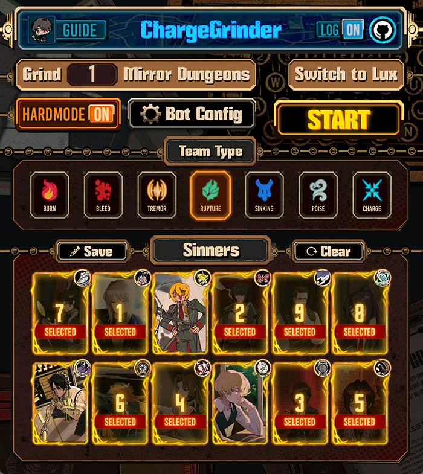
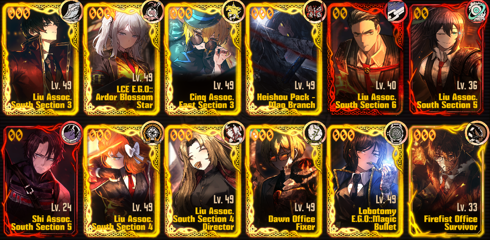
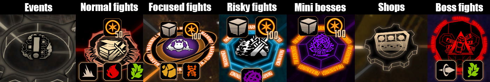
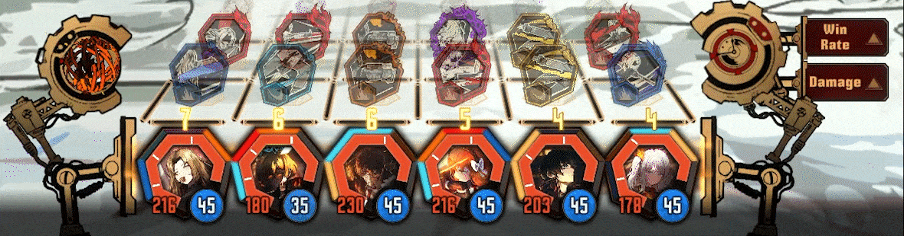
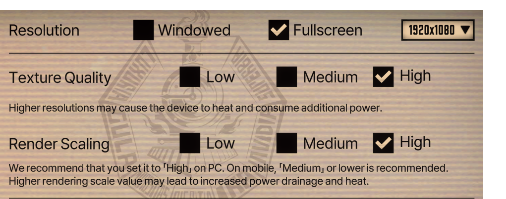
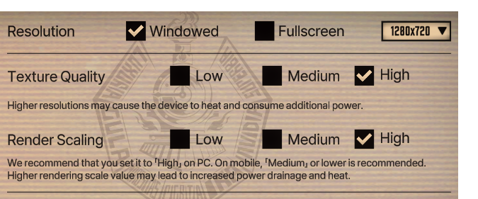

```
                   ________                             ______     _           __         
                  / ____/ /_  ____ __________ ____     / ____/____(_)___  ____/ /__  _____
                 / /   / __ \/ __ `/ ___/ __ `/ _ \   / / __/ ___/ / __ \/ __  / _ \/ ___/
                / /___/ / / / /_/ / /  / /_/ /  __/  / /_/ / /  / / / / / /_/ /  __/ /    
                \____/_/ /_/\__,_/_/   \__, /\___/   \____/_/  /_/_/ /_/\__,_/\___/_/     
                                      /____/

                          A Limbus Company bot that charges through MD5 for you
```

<p align="center"></p>

### ⚡ Speed
Generally, each floor takes no more than 5 minutes, so a full MD5 run lasts between **20–25 minutes** for a Burn team.

---

# ChargeGrinder:
- ## Starts from any moment of dungeon exploration
  - But it is still recommended to start on main game screen
- ## Supports all team builds (Burn is recommended)
  - ***Pick the right team before starting the bot!***
  - Burn is the fastest team with average time of 22 minutes per run.
  - If team members are already selected, bot will **not** change your selection.
  - Bot only selects team memebers if selected number for battle is less than 6.
  - Recommended team:
  
> 
---

- ## Selects Floor Packs
  - Avoids packs with high mortality rate and long fights such as: <p>
  **The Noon of Violet, Murder on the WARP Express, Full-Stopped by a Bullet, Timekilling Time, Nocturnal Sweeping** and some other.
  - Prioritizes floors with unique ego gifts such as: <p>
  **The Outcast, Hell's Chicken, To Claim their Bones** and some other.

- ## Selects the best next node
  - The choice priority order: <p>
**Event, Normal fight, Miniboss fight, Risky fight, Focused fight**
  - Mostly the bot just looks at the next 3 nodes, but it will also look 2 nodes ahead if the next node choice is uncertain. 
  - The main purpose of node picking is minimizing time.
  - Bot can detect:
> 

- ## Handles battles
  - Winrates focused encounters.
  - Chains skills 1 and 2 for human encounters. 
  - Skill 3 animations take more time than necessary so it is best to avoid it.
  - Doesn't use any EGO, because it is a huge time waste.
> 

- ## Selects team-related important EGO gifts
  - EGO gift priority:
    - Gifts that are needed for fuse recepies
    - Highest tier gifts (to fuse later)
    - Same gifts as team affinity

- ## Makes a good team affinity build in shop
  - Fuses gifts to get powerful Tier 4s
  - Upties and buys affinity-related gifts
- ## Restarts if run fails
  - If 6 or more sinners are dead, the bot (with default settings) will restart the run.
- ## Reclicks if action failed
  - Sometimes timings mess up, so in order to address this issue most bot actions are double-verified.


**Limitations:**  
ChargeGrinder still needs additional features, testing, and bug fixes. However, it can successfully grind a few easy dungeons while you are asleep (that's how I do it at least).

---
# Installation
### 📦 Option 1: Run the Prebuilt Executable 
[](https://github.com/AlexWalp/Mirror-Dungeon-Bot/releases/download/v1.0.0/CGrinder.exe) <p>
- Launch **CGrinder.exe** from the `dist` folder—no additional files required.
- No OCR is used anymore, all detection is now done with open cv.

### 🐍 Option 2: Run with Python
Make sure you have **Python 3** installed. Then either:
```bash
pip install -r requirements.txt
```
or manually install:
- `numpy`
- `opencv-python-headless`
- `pyautogui`
- `Pillow`
- `PyQt6`

Then you can run `App.py` for GUI interface or run `Bot.py` for cmd input without GUI.

---
# Usage:

- **User Input:**  
  You can set up sinners and other settings upon program execution. ChargeGrinder will start running in 10 seconds after that. 
  In the meantime you should switch to the Limbus Company window, main screen. It is not recommended to move the mouse while the bot is running, but you can Alt+Tab to another window and the bot will pause.

- **Runtime Requirements:**
  - Set the in-game resolution to **16:9** ratio (**1920 x 1080** is best, but **1280 x 720** also works). Both fullscreen and windowed modes are supported.<p>
  *Make sure that the Limbus Company window is fully visible!*
  - Pre-select your team.
  - If you have multiple keyboard layouts, make sure you have **ENG** selected before starting the bot.
# Recommended Graphics Settings:
<p align="center" style="font-size: 19px; font-weight: bold">Fullscreen</p>
<p align="center"></p>
<p align="center" style="font-size: 19px; font-weight: bold">Windowed</p>
<p align="center"></p>

---
# Settings To Run Without GUI:

**Upon startup, you can configure these settings:**

| Setting   | Description | How to Change |
|:----------|:------------|:--------------|
| **TEAM** | Selected build type (currently only `BURN` is supported) | `TEAM <TYPE>` |
| **SELECTED** | Default sinners the bot will pick (if you didn’t manually select) | `SELECTED 1 2 3 4 5 6` <p>(six sinners in ascending order) <br> _(Type `SINNERS` to see the list)_ |
| **BONUS** | Collect weekly bonuses automatically | `BONUS TRUE` to turn it on |
| **RESTART** | Restart failed runs automatically | `RESTART FALSE` to turn it off |
| **ALTF4** | Close Limbus Company when done (or stuck) | `ALTF4 TRUE` to turn it on |
| **LOG** | Save important events and errors to `game.log` | `LOG FALSE` to turn it off |

---

# Sinners List
```
1. YISANG          7.HEATHCLIFF
2. FAUST           8.ISHMAEL
3. DONQUIXOTE      9.RODION
4. RYOSHU         10.SINCLAIR
5. MEURSAULT      11.OUTIS
6. HONGLU         12.GREGOR
```
> Select six sinners in ascending order when using the `SELECTED` command.
---
# stats.py
- You can run stats.py file from this repository to view your MD run statistics
- Make sure that `file = "game.log"` actually points to your `game.log` file
- Output looks like this:
```
📊 Floor Fight Statistics
🧱 Floor 1
Type      |  Avg Time  | Count
--------------------------------
Normal    |    0:49    |  35  
Focused   |    0:00    |   0  
Risky     |    0:00    |   0  
Miniboss  |    0:00    |   0  
Boss      |    1:16    |  18  

🧱 Floor 2
Type      |  Avg Time  | Count
--------------------------------
Normal    |    0:46    |  33  
Focused   |    0:48    |   3  
Risky     |    1:12    |   2  
Miniboss  |    0:00    |   0  
Boss      |    1:01    |  18  

🧱 Floor 3
Type      |  Avg Time  | Count
--------------------------------
Normal    |    0:37    |  25
Focused   |    0:47    |   3
Risky     |    1:22    |   6
Miniboss  |    0:55    |   1
Boss      |    1:11    |  18

🧱 Floor 4
Type      |  Avg Time  | Count
--------------------------------
Normal    |    1:04    |  20
Focused   |    1:28    |   5
Risky     |    1:24    |   4
Miniboss  |    1:14    |   7
Boss      |    1:10    |  18

🧱 Floor 5
Type      |  Avg Time  | Count
--------------------------------
Normal    |    1:08    |  31
Focused   |    1:32    |   8
Risky     |    1:43    |   4
Miniboss  |    0:57    |   4
Boss      |    1:00    |  18

📦 Floor Time Summary
Floor | Avg Time | Count
--------------------------
  1   |   4:05   |  18
  2   |   3:58   |  18
  3   |   4:10   |  18
  4   |   5:04   |  18
  5   |   5:06   |  18

🏁 Run Summary
Successful Runs | Avg Run Time | Failed Runs | Total Time Wasted
----------------------------------------------------------------
      18        |    22:44     |      0      |       0:00
```
---

#  TODO List
- Add support for **Hard MD** runs (this seems possible).
- Improve mouse behavior with more natural movements in the future (though the game doesn't track mouse movements, so not urgent).
