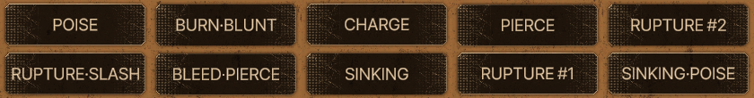
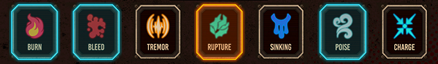
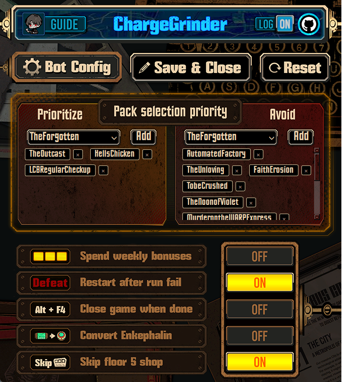
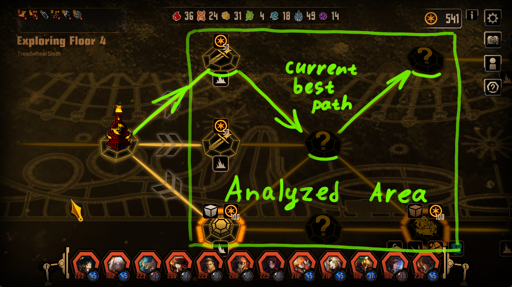
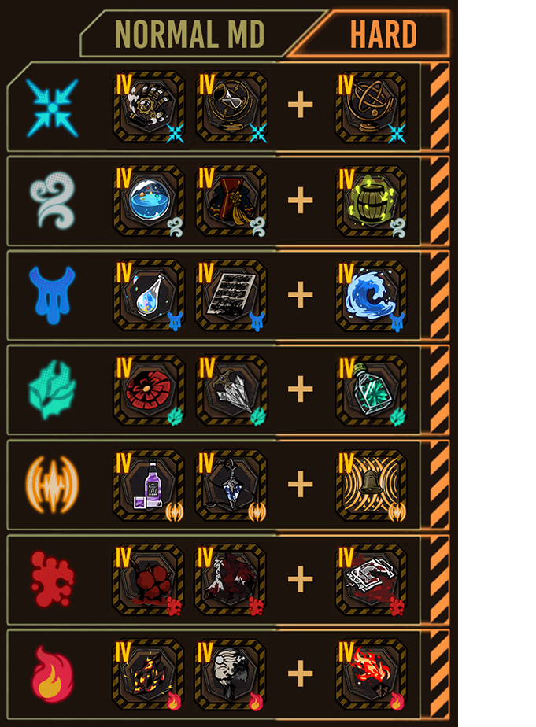

<p align="center" style="margin: 0px">
<a href="https://github.com/AlexWalp/Mirror-Dungeon-Bot/releases/latest/download/app.exe" style="text-decoration: none; display: inline-block;">
  
</a>


</p>
<p align="center" style="margin-bottom: 5px"> 
<a href="https://www.paypal.com/ncp/payment/98WFWFCUHLQML">
  
</a>
<a href="https://github.com/sponsors/AlexWalp">
  
</a>
</p>
<p align="center" > You can contact me on Discord: @walpth</p>

```
                   ________                             ______     _           __         
                  / ____/ /_  ____ __________ ____     / ____/____(_)___  ____/ /__  _____
                 / /   / __ \/ __ `/ ___/ __ `/ _ \   / / __/ ___/ / __ \/ __  / _ \/ ___/
                / /___/ / / / /_/ / /  / /_/ /  __/  / /_/ / /  / / / / / /_/ /  __/ /    
                \____/_/ /_/\__,_/_/   \__, /\___/   \____/_/  /_/_/ /_/\__,_/\___/_/     
                                      /____/

                          A Limbus Company bot that charges through MD6 for you
```

---

<div style="overflow: auto; margin-bottom: 20px;">
  

  - ### ⚡ Speed
  A **Normal MD6** run lasts between **23-25 minutes**.
  And it takes **35-45 minutes** for one **Hard MD** run with a Rupture team.

  - ### Starts from any moment of MD exploration

  - ### Restarts if run fails
  If 6 or more sinners are dead, the bot (with default settings) will restart the run.

  - ### Reclicks if action failed
    Sometimes timings mess up, so in order to address this issue most bot actions are verified.

  - ### Supports Luxcavation grind
</div>

# Functionality:

- ## Auto-selects the team
  ### *This means that you need to set up the correct team names in advance.*
  - Supported team keywords: <br>
  **SLASH, PIERCE, BLUNT, BURN, BLEED, TREMOR, RUPTURE, SINKING, POISE, CHARGE**
  - Any two-word combination of these keywords (without #number) is also supported
  - For single-word team names, #number is supported
  - The bot scrolls through teams until it finds the uppermost matching team
  - Uses default team if it fails to find the right team
  ### Supported name examples:



- ## Rotates teams
  - *Orange* - currently displayed team
  - *Blue* - other teams included in the rotation
  - The rotation starts from the curretly displayed team and moves from left to right



- ## Supports all team builds
  <div style="display: flex; justify-content: space-between;">
    <div style="flex: 1; padding-right: 10px;">
      <h3 style="margin-top: 0px;">Normal MD:</h3>
      <ul style="padding-left: 20px;"> 
        <li>Rupture is the fastest team with average time of <br> 24 minutes per run.</li>
      </ul>
    </div>

    <div style="flex: 1; padding-left: 10px;">
      <h3 style="margin-top: 0px;">Hard MD:</h3>
      <ul style="padding-left: 20px;">
        <li>Rupture is the best team with average time of <br> 38 minutes per run.</li>
      </ul>
    </div>
  </div>


- ## Selects Floor Packs

  <div style="overflow: auto; margin-bottom: 20px;">
    

    ### By default:
    - Avoids packs with high mortality rate and long fights such as:  
      **The Noon of Violet, Murder on the WARP Express, Full-Stopped by a Bullet, Timekilling Time, Nocturnal Sweeping** and some other.
    - Prioritizes floors with unique ego gifts such as:  
      **The Outcast, Hell's Chicken** and some other.
    <br>

    ### You can set your own pack priority in config!
    - ***Important note: Prioritized packs are specific to each team type, but Avoided packs apply globally to all teams.***
    - ***There are two different configs for Normal MD and Hard MD***
  </div>

- ## Selects the best next node
  ### Bot can detect:

  

  ### Time cost of each node: <p>
  - **Event: 0s, Normal: 52s, Miniboss: 67s, Focused: 77s, Risky: 87s**

  ### The bot analyzes all visible nodes and builds the fastest path:

  

- ## Handles battles
  ### Normal MD:
  - Winrates focused encounters.
  - Chains skills 1 and 2 for human encounters. 
  - Skill 3 animations take more time than necessary so it is best to avoid it.
  - Doesn't use any EGO, because it is a huge time waste.

  

  ### Hard MD:
  - **All battles** are winrated.
  - If the clash is **Struggling** or **Hopeless**, the bot uses the leftmost available EGO.
  - If the clash is **Struggling/Hopeless** and an EGO is selected, it will be replaced with a defense skill.
  
  

- ## Fuses EGO gifts
<div style="overflow: auto; margin-bottom: 20px;">


 ### Makes a good team affinity build in shop
  - Fuses gifts to get powerful Tier 4s.
  - Upties and buys affinity-related gifts.
  - If not all gifts are visible, it can **scroll through inventory** while fusing.
  <br><br>

  **If no tier 4 in inventory:**
  - The bot aggressively fuses the **first Tier 4 gift**, even using same-affinity gifts if needed.
  <br><br>

  **Once the first build-related Tier 4 gift is obtained:**
  - Same-affinity gifts will **no longer be used for fusing**.
  <br><br>

  **Once the affinity build is complete:**
  - The bot will browse the shop for **same-affinity gifts** and buy them when found.
</div>

# Video showcase (old version 1.0.3):
<p align="center">
  <a href="https://www.youtube.com/watch?v=z3zJ8AMfWpw">
    
  </a>
</p>

# User warning!
<div style="; border: 2px solid red; padding-left: 20px; padding-right: 20px; padding-top: 15px; border-radius: 5px;">

This tool does not modify or access any game files and relies solely on the displayed information. <br> 
There have been no precedents of bans due to using this or similar tools, but I advise against excessive usage for longer than what is humanly possible. <br>
I also advise against sharing your in-game ID along with the fact that you use this tool.

</div>

# Installation
### 📦 Option 1: Run the Prebuilt Executable 
[](https://github.com/AlexWalp/Mirror-Dungeon-Bot/releases/latest/download/app.exe) <p>
- Launch **app.exe** from the latest release - no additional files required.
- No OCR is used anymore, all detection is now done with open cv.

### 🐍 Option 2: Run with Python
Make sure you have **Python 3** installed. Then either:

`pip install -r requirements.txt`

or manually install:
- `opencv-python-headless`
- `numpy`
- `PyQt6`

Then you can run `App.py` for GUI interface or run `Bot.py` for cmd input without GUI.

# Usage:
 
<div style="; border: 2px solid orange; padding: 10px; padding-bottom: 0px; border-radius: 5px; margin-bottom: 10px;">
  <strong>Game interface must be in English!</strong><br>
  <strong>Make sure that the Limbus Company window is fully visible!</strong><br>
  <p>Set the in-game resolution to <strong>16:9</strong> ratio (<strong>1920x1080</strong> is best, but <strong>1280x720</strong> also works)</p>
</div>

- You can set up sinners and other settings upon program execution. ChargeGrinder will start running in 10 seconds after that. 
- In the meantime you should switch to the Limbus Company window. It is not recommended to move the mouse while the bot is running, but you can Alt+Tab to another window and the bot will pause.

# Recommended Graphics Settings:

<div style="overflow: auto; margin-bottom: 20px;">


<h3 style="margin-top: 0px;">1920x1080</h3>

  - Provides the best detection result
  - If your screen is Full HD or lower with a 16:9 aspect ratio, use Fullscreen at your screen's native resolution
  - If your screen resolution is higher than Full HD, use Windowed instead
</div>

<div style="overflow: auto; margin-bottom: 20px;">


<h3 style="margin-top: 0px;">1280x720</h3>

  - The resolution I usually test new versions with (and mostly use)
  - Use windowed mode only
</div>

# Run stats

<div style="overflow: auto; margin-bottom: 20px;">


<h3 style="margin-top: 12px;">You can export run data from game.log file to game.csv</h3>
</div>

### Example game.csv:
| NORMAL     | BURN |
|------------|------|
| Avg Time   | Count|
| 24:37      | 1    |

| Fights     | Normal | Focused | Risky | Miniboss | Boss | Total  |
|------------|--------|---------|-------|----------|------|--------|
| Floor1     | 00:47  | none    | none  | none     | 02:20| 05:02  |
| Floor2     | 00:44  | none    | none  | none     | 01:28| 04:29  |
| Floor3     | 00:39  | none    | 01:08 | none     | 01:01| 04:12  |
| Floor4     | 00:46  | none    | none  | 01:07    | 01:03| 04:17  |
| Floor5     | 00:52  | 01:47   | none  | none     | 01:49| 06:15  |

| Packs               | EmotionalRepression | AddictingLust | HellsChicken | TheOutcast | RepressedWrath |
|---------------------|---------------------|---------------|--------------|------------|----------------|
| Avg Time           | 04:12               | 04:17         | 04:29        | 05:02      | 06:15          |
| Count              | 1                   | 1             | 1            | 1          | 1              |