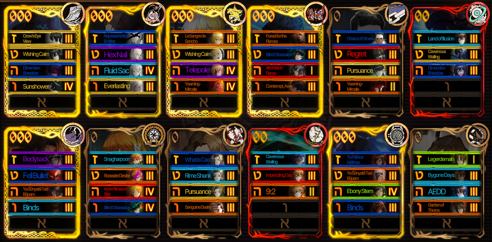

# ChargeGrinder
**ChargeGrinder** is a bot for MD5 grinding in Limbus Company, tested on Easy Mirror.

### Features:
- **Automated Mirror Dungeon Runs:** ChargeGrinder will automatically complete all floors of the Mirror Dungeon.
- **User Input:** The program will prompt you to enter the number of Mirror Dungeons to grind, and it will start running a few seconds after your response (You must switch to Limbus Company window).
- **In-Game Requirements:** 
    - You must leave the Limbus Company window open and in fullscreen mode while the bot runs. Mouse interactions in the game will be controlled by the bot.
    - If you close the Limbus Company window, the bot will automatically pause.
- **Current Behavior:**
    - No starting bonuses (for now)
    - Uses default team
    - The bot indiscriminately selects Ego gifts (except for the first one).
    - It uses shops only to heal all.
    - The bot winrates all fights and spams EGO on abnormalities (It only knows a few egos for now).
    - Also bot avoids a few Booster Packs with difficult fights (Dongbaek, Crabking, Casseti, Kim, Timekilling time and Ordeal of Violet Noon)
- **Limitations:** ChargeGrinder still needs additional features, testing, and bug fixes. However, it can successfully grind a few easy dungeons while you are sleeping.

---

### Requirements:
- Python 3
- `time`
- `os`
- `pyscreeze`
- `pyautogui`

---

### Setup Instructions:

1. **Team Setup:** 
   - ChargeGrinder is currently tested with an Uptie 3-4 charge team.
   
   - Highly recommended EGO:
     - Yi Sang's *Crow's Eye View*
     - Faust's *Fluid Sack*
   

2. **Game Settings:**
   - Set the game resolution to Full HD (1920 x 1080) in fullscreen mode.
   - Start the bot and immediately switch to Limbus window on the main game screen.
   - Ensure the "fork" button in fights is in the 3-arrow grey mode (the mode without visible red arrows on coins).
   - Also, if you have multiple languages in keyboard layout, make sure you have ENG selected before starting the bot (important for pyAutoGui)

3. **Recommended Team:** 
   - Currently, only charge team with starting Ego gifts are tested.
   - Ensure the team and all 6 sinners are selected before starting the bot. The game usually remembers the previously used sinners.

---

### TODO List:
- Add support for different team builds.
- Refactor the code for better structure.
- Implement more natural mouse movements for the bot.
- Improve abnormality fights (coin targeting instead of winrate).
- Rewrite `pyautogui` functions using the `win32` library to allow the bot to run in the background.
- Create a bot UI using PyQt6.
